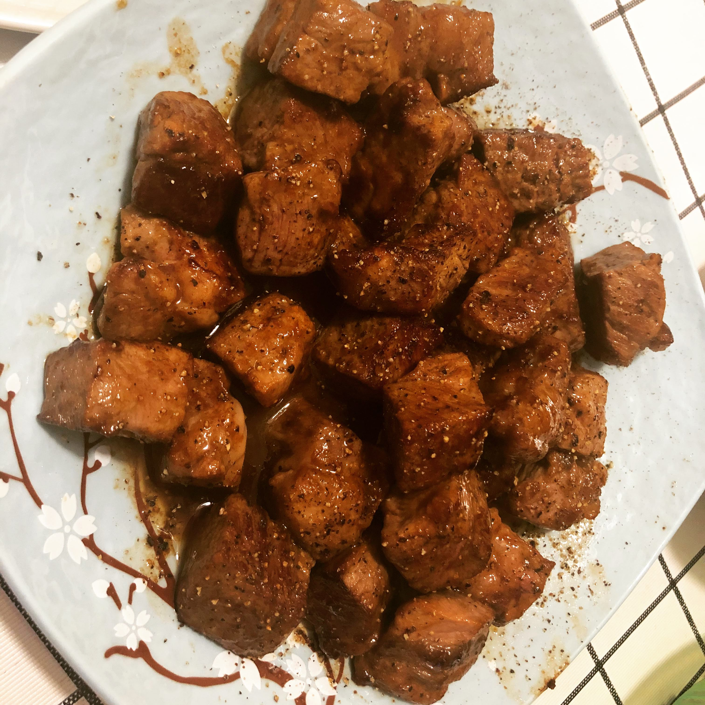

# 黑椒牛肉粒

## 原料

1. 牛排（最好厚牛排，种类不限，看个人喜好）
2. 橄榄油/花生油
3. 黑胡椒酱
4. 黑胡椒颗粒
5. 黄油

## 准备

1. 醒好牛排，切1.5～2 cm的小粒
2. 准备一小块黄油（牛肉粒一半大小就差不多）

## 制作

1. 平底锅放油，大火烧热（少量油甚至不放都行）
2. 放入牛肉粒，煎到四面焦黄色
3. 改小火，放入黄油化开，让牛肉粒都浸润上黄油，关火
4. 加入黑胡椒酱，趁着余热翻炒让牛肉粒均匀沾上黑胡椒酱
5. 盛盘，撒上现磨黑胡椒颗粒（如果黑胡椒颗粒不带盐，可再撒点儿盐）

