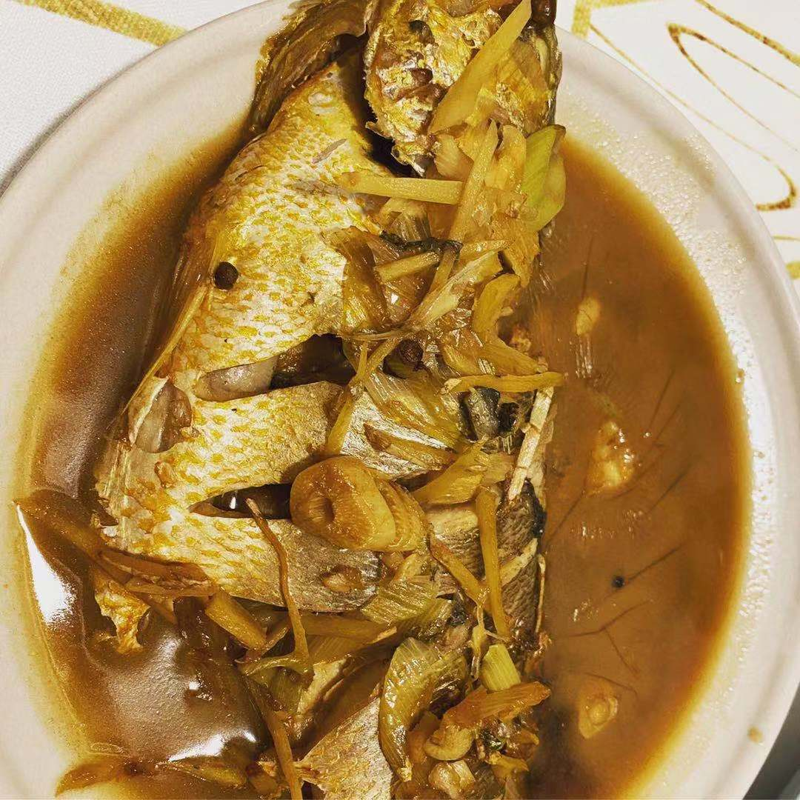

# 红烧黄花鱼

## 原料

1. 黄花鱼
2. 生抽酱油
3. 老抽
4. 盐
5. 姜
6. 葱
7. 蒜
8. 花椒
9. 香菜
10. 料酒

## 准备

1. 姜切丝
2. 黄花鱼洗净，尤其肚子内的黑膜和头里面的黑膜一定要去干净
3. 黄花鱼两面划几刀，放入姜丝，先腌制一会儿，去准备其它辅料
4. 葱切葱花，蒜切片

## 制作

1. 把锅烧热，加宽油把油烧热，润锅
2. 改中小火，放入黄花鱼，把两面煎一下
3. 加花椒、葱姜蒜爆香
4. 淋入生抽，加清水刚淹没过鱼就行
5. 汤汁烧开后淋入料酒，加老抽稍微调色
6. 根据咸蛋，加入盐，持续大火炖到汤汁很少
7. 根据喜好，撒上香菜出锅（最好直接从锅里倒出来，保持鱼的完整）

