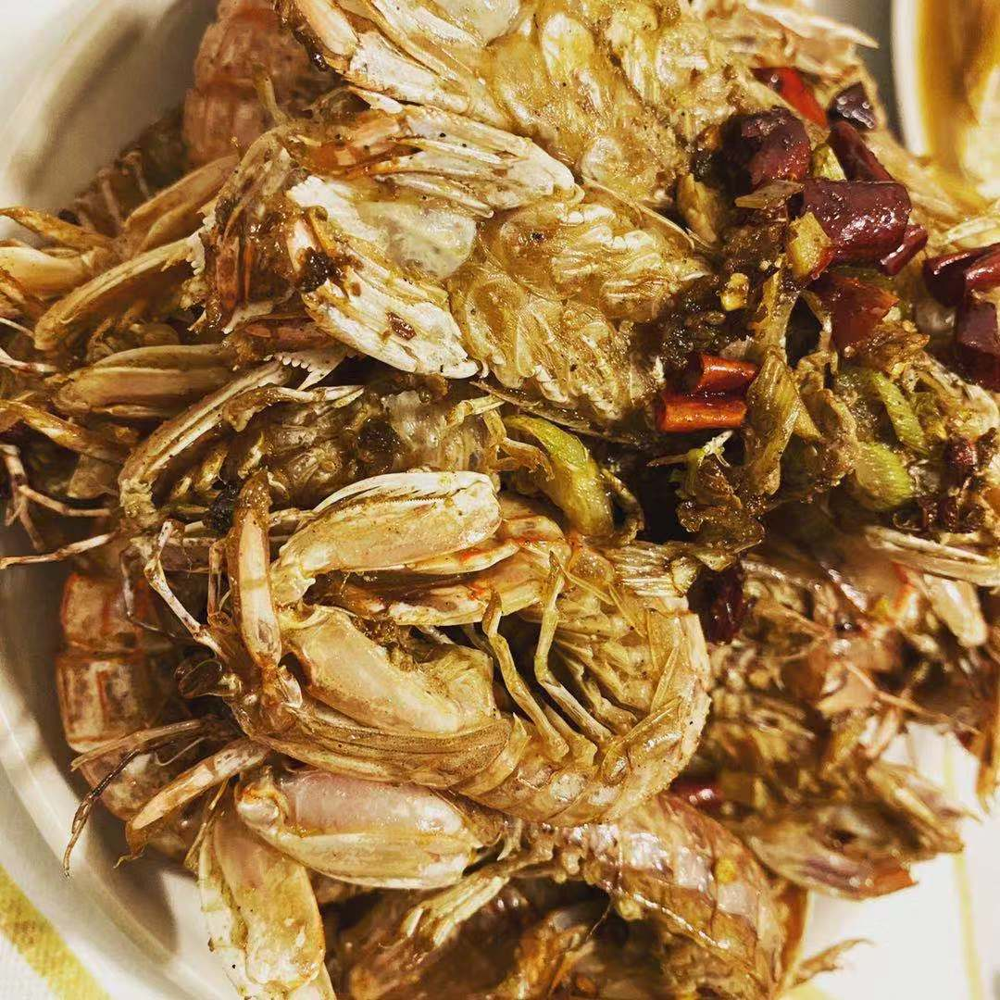

# 椒盐皮皮虾

## 原料

1. 皮皮虾
2. 干辣椒
3. 花椒
4. 椒盐
5. 青红椒
6. 葱、姜、蒜（一头）
7. 盐

## 准备

1. 葱切葱花
2. 姜拍一下，切粒
3. 一头蒜拍一下，切成蒜末
4. 干辣椒四五个剪成小段
5. 青红椒切小块（为了好看，可有可无）
6. 皮皮虾洗净沥干水分

## 制作

1. 锅烧热，大火，放宽油到5成热
2. 放入皮皮虾，炸到酥脆（主意调整火大小，别炸糊了）
3. 捞出皮皮虾控油
4. 国内留底油，放入花椒、葱、姜、蒜，小火爆香
5. 放入皮皮虾和青红椒，翻炒均匀
6. 稍微加点儿盐调味
7. 撒入椒盐，翻炒后出锅

