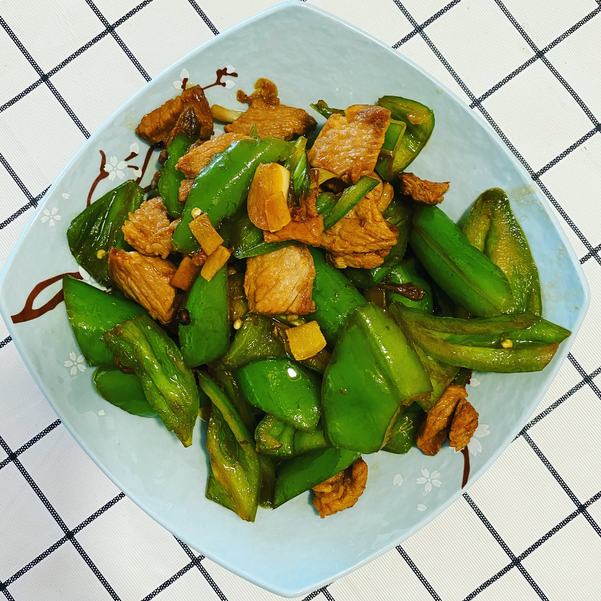

# 青椒炒肉

## 原料

1. 青椒/彩椒/菜椒/青辣椒
2. 葱姜蒜
3. 五花肉
4. 生抽/味极鲜酱油
5. 花椒

## 准备

1. 青椒洗净切块
2. 肉切2mm左右薄片
3. 切葱花、姜丝、蒜片

## 制作

1. 热锅，宽油
2. 放入肉片，煸炒出油
3. 下花椒、葱姜蒜，爆香
4. 大火，放入青椒，炒到断生
5. 淋入味极鲜酱油，根据个人口味可以加盐
6. 炒出香味，改小火，盖锅盖，闷两分钟入味
7. 开盖，大火，淋明油炒几下
8. 出锅，盛盘

