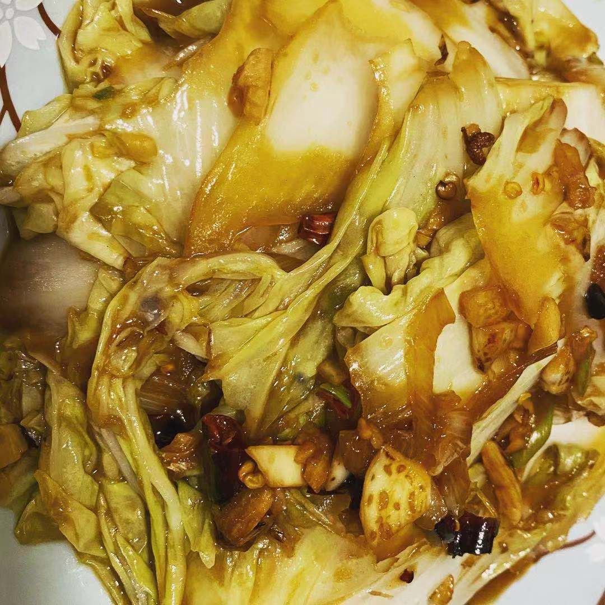

# 酸辣白菜

## 原料

1. 干辣椒四五个
2. 大蒜一头
3. 青红椒一个
4. 小米辣椒
5. 姜一小块
6. 盐、醋、酱油、蚝油
7. 水淀粉
8. 大白菜

## 准备

1. 大蒜拍碎切末
2. 干辣椒切段
3. 小米辣切小圈儿
4. 青红椒切小块
5. 以上放入碗中备用
6. 取一个碗放适量盐，一点蚝油，放入1:1的醋和酱油
7. 加少许水淀粉加清水和匀备用
8. 大白菜斜着片成片（也可以手撕）

## 制作

1. 热锅后放油烧热
2. 小火，把第一碗料炒香
3. 放入大白菜，大火爆炒到断生
4. 倒入料汁儿，继续大火翻炒收汁儿
5. 加明油翻炒两下出锅盛盘

