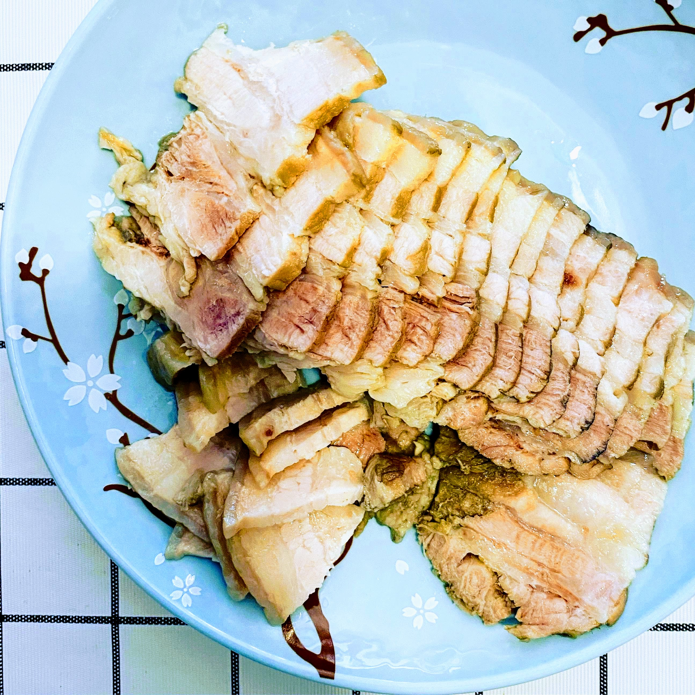

# 蒜泥白肉

## 原料

1. 五花肉/后臀肉
2. 花椒、大料、酱、蒜、香叶、食盐
3. 香醋、生抽、蚝油、香油、料酒

## 准备

1. 大块五花肉冷水下锅焯水
2. 蒜拍碎
3. 姜切片

## 制作

1. 冷水，放入焯水过的五花肉，放入大料、香叶，料酒、姜片，煮至筷子可以轻松插透五花肉（大约40分钟）
2. 煮肉期间调料汁：
   1. 生抽：醋：香油 大约 2：2：1比例
   2. 加少许蚝油、一点糖
   3. 放入蒜末（或者砸好的蒜泥更佳）
   4. 加点儿水，搅拌均匀。（根据个人口味可以适量加点儿盐）
   5. 喜欢辣，可以加一个🌶️圈儿
3. 肉煮好后，放入冷水冷却
4. 冷却好的肉，切2mm左右的薄片，摆盘即可

