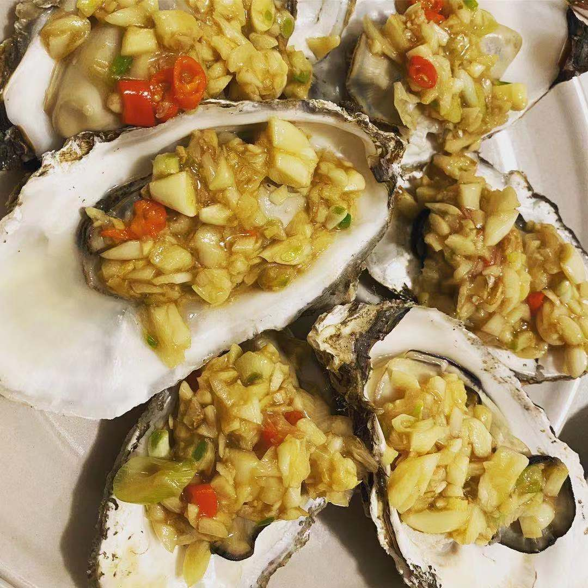

# 蒜蓉蒸生蚝

## 原料

1. 生蚝
2. 大蒜，最少4头
3. 小米辣椒
4. 盐

## 准备

1. 生蚝洗净，敲开
2. 蒜拍碎，切成蒜末（也可以打成蒜蓉）
3. 小米辣切成圈儿

## 制作

1. 把锅烧热，放油加热到四五成热
2. 小火，放入一半的蒜蓉，慢慢炒香，炒到金黄色
3. 加盐，放入剩下蒜蓉的一半，翻炒一下出锅，盛到碗中
4. 把剩下到生蒜也放进去，加入小米辣椒圈，拌匀
5. 把生蚝在蒸屉中摆放整齐，用勺子放一半到蒜蓉到生蚝上
6. 开锅后，蒸5分钟，把生蚝摆到盘中
7. 把剩下到蒜蓉再次放到生蚝上
8. 锅里热油后，把油依次泼到生蚝上即可

