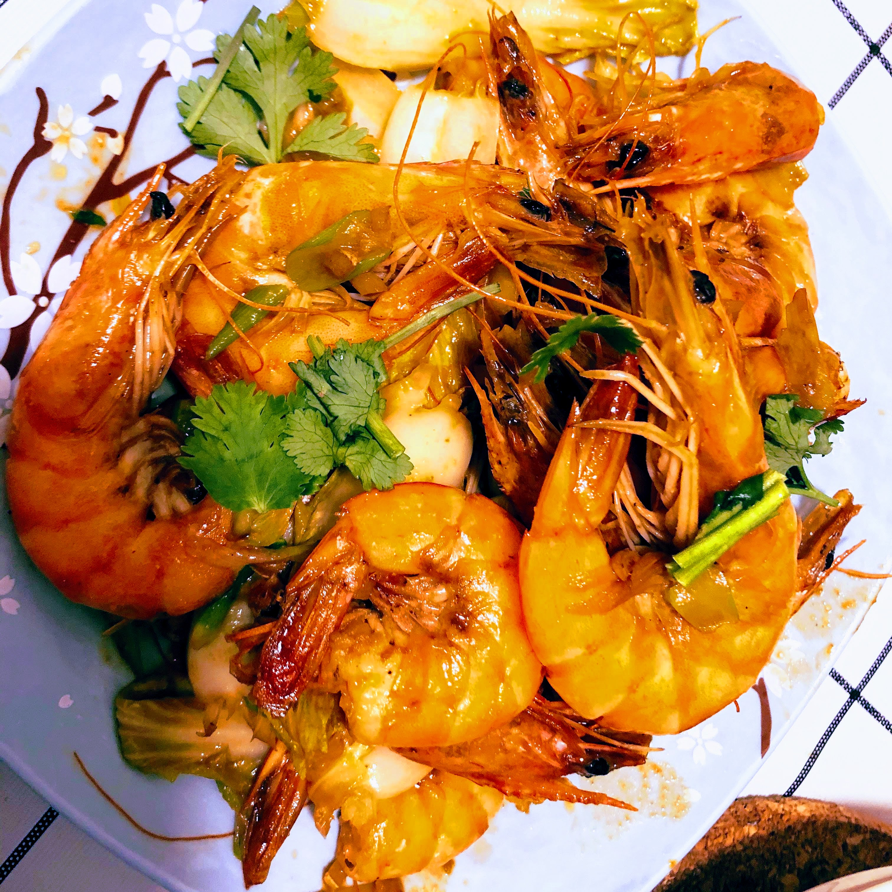

# 鲜虾白菜

## 原料

1. 大虾
2. 白菜少许
3. 香菜一颗
4. 葱、姜、蒜、花椒
5. 生抽（味极鲜酱油均可）

## 准备

1. 鲜虾洗净，剪掉虾须，挑去虾线
2. 葱姜蒜切末
3. 香菜切段
4. 白菜少许切段即可

## 制作

1. 热锅，宽油，中小火
2. 下葱、姜、蒜、几粒花椒，爆香
3. 放入大虾煸炒至出虾油
4. 放入白菜，大火，炒至断生
5. 淋入少许生抽，翻炒出香气
6. 关火，盛盘，撒上香菜

