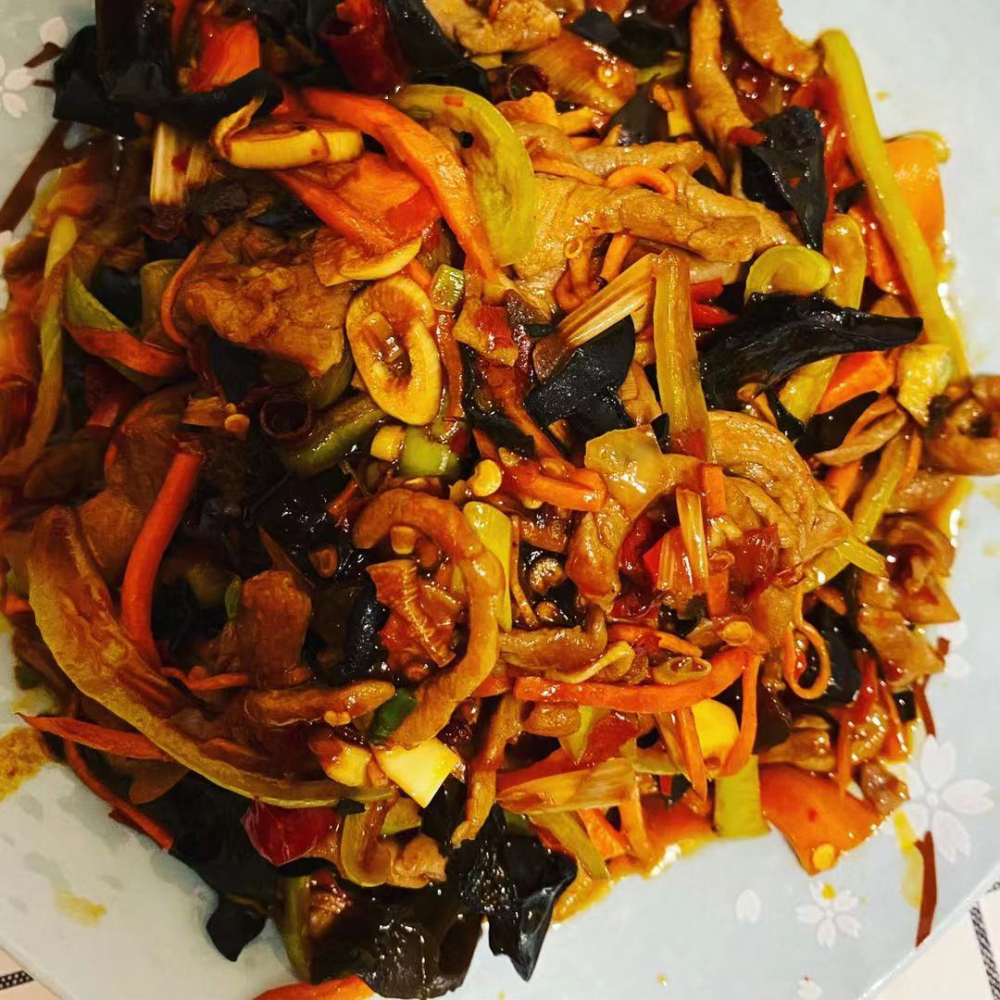

# 鱼香肉丝

## 原料

1. 葱、姜、蒜、花椒
2. 胡萝卜
3. 笋丝
4. 木耳
5. 青椒一个/柿子椒（都行）
6. 里脊肉
7. 香油、生抽、醋、蚝油
8. 白糖
9. 郫县豆瓣
10. 剁椒
11. 干辣椒一个
12. 淀粉

## 准备

1. 里脊肉切丝（顺着切），放点盐、生抽、淀粉，抓匀腌两分钟
2. 葱姜蒜切末，干辣椒剪成段
3. 胡萝卜切丝
4. 木耳泡发后切丝
5. 如果有笋，切丝，焯水备用
6. 青椒切丝
7. 香油、生抽、醋（生抽四倍）、一勺白糖、一点儿蚝油，放到碗里拌匀
8. 淀粉和水1：4，少许
9. 炒之前在腌制好都里脊肉丝上淋上些花生油拌匀

## 制作

1. 把锅烧热，放相对多点儿油，转小火放入肉丝炒散，肉丝变色后，盛出来
2. 用锅里剩下的油，放入几粒花椒、一勺郫县豆瓣、一勺剁椒，小火超出红油
3. 放入葱姜蒜炒香
4. 放入笋丝、青椒丝、胡萝卜丝、木耳丝，翻炒几下，放入炒好的肉丝一起翻炒
5. 淋入酱汁，大火翻炒，同时一点一点往里加水淀粉勾芡收汁儿到合适的浓度
6. 加上点儿明油翻炒几下出锅盛盘

